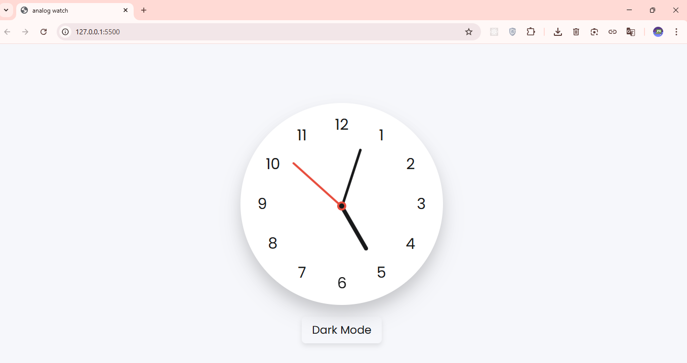

# 🕒 Analog Watch (Dark & Light Mode)

This is a simple **Analog Watch** project built using **HTML, CSS, and JavaScript**.  
It shows the current time using rotating hour, minute, and second hands, and also supports **Dark Mode** that saves your theme preference using `localStorage`.

---
## 🚀 Demo

### 🌐 Live demo: [click here](https://digitalclock-shifat01.netlify.app/)

#### or, 

### link: https://digitalclock-shifat01.netlify.app
---

## 📸 Preview

---

## 🚀 Features
- Real-time working analog clock  
- Smooth rotation of hour, minute, and second hands  
- Dark & Light mode toggle  
- Mode preference saved in local storage  
- Fully responsive layout  

---

## 🧠 Technologies Used
- **HTML5** – for structure  
- **CSS3** – for styling  
- **JavaScript (ES6)** – for time calculation and mode switching  

---

## ⚙️ How It Works
1. The JavaScript `Date()` object fetches the current time.  
2. Each hand (hour, minute, second) is rotated using **CSS transform (rotate)**.  
3. The **mode switch button** toggles between light and dark themes.  
4. The selected mode is stored in the browser’s **localStorage**.

---

## 🏃‍♂️ How to Run
1. Download or copy the project files.  
2. Open the folder in **VS Code**.  
3. Run the `index.html` file using **Live Server** or open it directly in a browser.  
4. You’ll see the analog watch on screen — try switching between **Dark** and **Light** mode!

---
## 🧑‍💻 Author
**Shifat**

